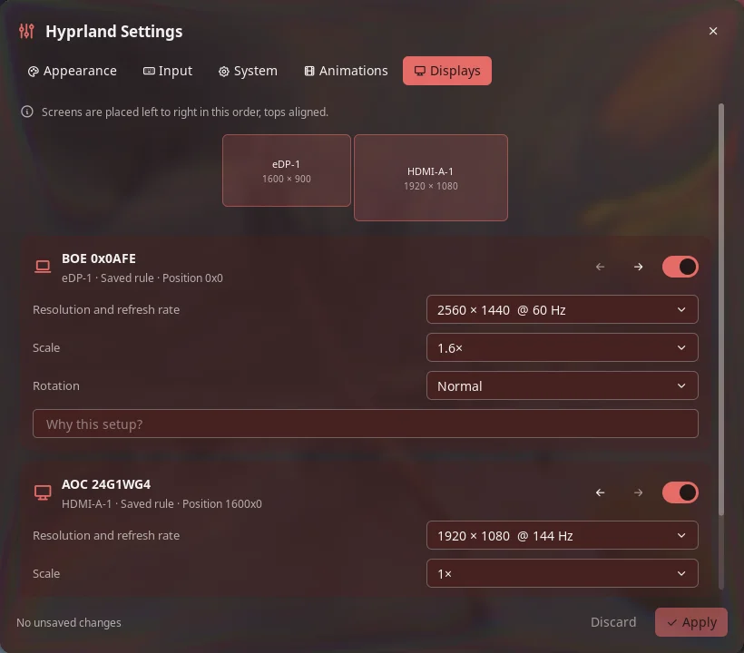

# Hyprland Settings for Noctalia

A [Noctalia](https://github.com/noctalia-dev/noctalia) plugin that gives Hyprland's Lua
config a settings panel: displays, input, appearance, animations and a few system
options. Every change is written to one Lua file with a reason per value, and it
reverts by itself after 15 seconds unless you keep it.



The plugin lives in [`hyprland-settings/`](hyprland-settings/). Its
[README](hyprland-settings/README.md) covers setup, usage, settings, IPC and exactly
which files and processes it touches.

## Install

From this repository as a plugin source:

```sh
noctalia msg plugins source add hyprland-settings git https://github.com/Michael-Retunzew/hyprland-settings
noctalia msg plugins enable michael-retunzew/hyprland-settings
```

Then type `hyprland` in the launcher. On first open the panel offers to connect itself to Hyprland; see the [plugin README](hyprland-settings/README.md#usage).

## Development

Link the plugin into Noctalia's data directory. Edits to `.luau` files reload live:

```sh
ln -s "$PWD/hyprland-settings" ~/.local/share/noctalia/plugins/hyprland-settings
noctalia msg plugins enable michael-retunzew/hyprland-settings
```

Tests need `luau`, `lua` and `luac`:

```sh
hyprland-settings/tests/run.sh
```

## License

MIT, see [LICENSE](LICENSE).
